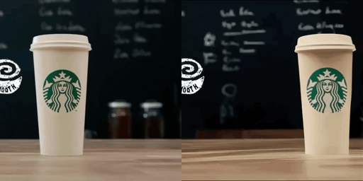
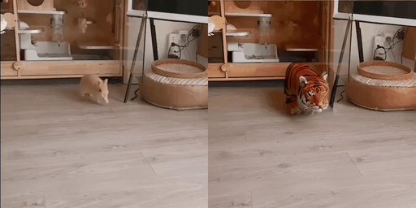
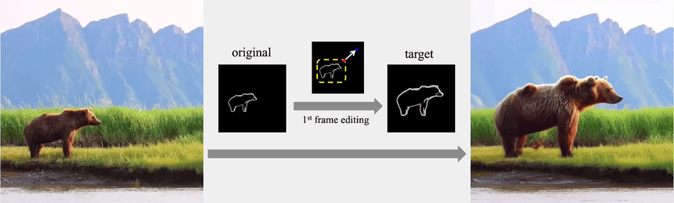
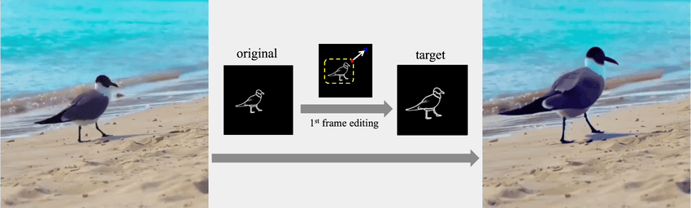
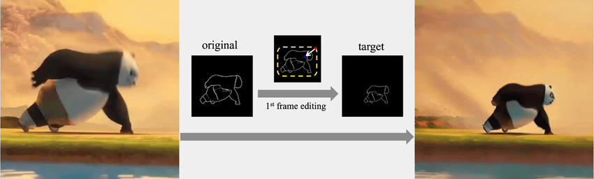
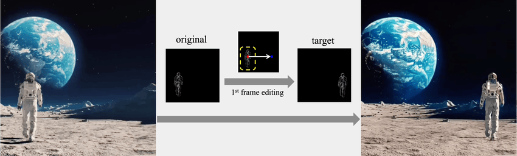
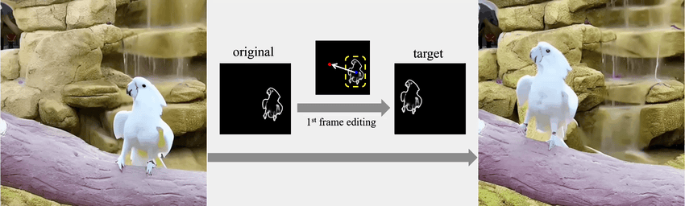
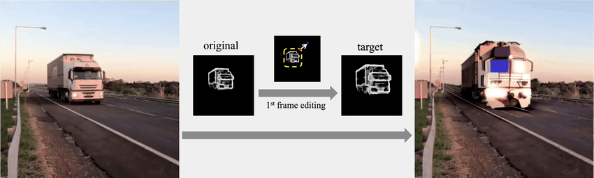
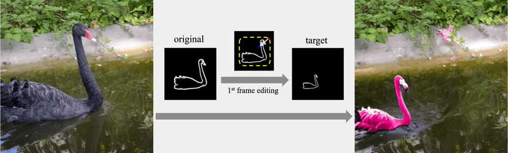
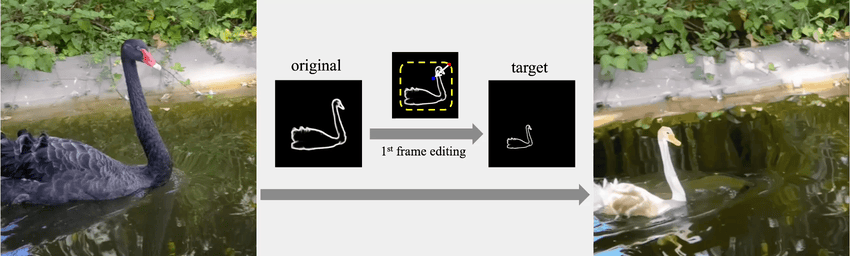

### MagicStick🪄: Controllable Video Editing via Control Handle Transformations

[Yue Ma](https://mayuelala.github.io/), [Xiaodong Cun](http://vinthony.github.io/), [Yingqing He](https://github.com/YingqingHe), [Chenyang Qi](https://chenyangqiqi.github.io/), [Xintao Wang](https://xinntao.github.io/), [Ying Shan](https://scholar.google.com/citations?user=4oXBp9UAAAAJ&hl=zh-CN), [Xiu Li](https://scholar.google.com/citations?user=Xrh1OIUAAAAJ&hl=zh-CN) and [Qifeng Chen](https://cqf.io)

<a href='https://arxiv.org/abs/2303.09535'></a> 
<a href='https://magic-stick-edit.github.io/'></a>  [](https://github.com/mayuelala/MagicStick)


<table class="center">
  <td></td>
  <td></td>
  <td></td>
  <tr>
  <td width=25% style="text-align:center;">"silver jeep ➜ posche car"</td>
  <td width=25% style="text-align:center;">"+ Van Gogh style"</td>
  <td width=25% style="text-align:center;">"squirrel,Carrot ➜ rabbit,eggplant"</td>
</tr>
</table >

## 📀 Demo Video


## 🎏 Abstract
<b>TL; DR: `MagicStick` is the first unified framework to modify video properties(e.g., shape, size, location, motion) leveraging the keyframe transformations on the extracted internal control signals.</b>

<details><summary>CLICK for the full abstract</summary>
            Text-based video editing has recently attracted considerable interest in changing the style or replacing the objects with
            a similar structure. Beyond this, we demonstrate that properties such as shape, size, location, motion, etc., can also be
            edited in videos. Our key insight is that the keyframe’s transformations of the specific internal feature (e.g., edge maps
            of objects or human pose), can easily propagate to other frames to provide generation guidance. We thus propose  <font color="red">MagicStick</font>,
             a controllable video editing method that edits the video properties by utilizing the transformation on the extracted internal
             control signals. In detail, to keep the appearance, we inflate both the pretrained image diffusion model and ControlNet to
             the temporal dimension and train low-rank adaptions (LORA) layers to fit the specific scenes. Then, in editing, we perform
              an inversion and editing framework. Differently, finetuned ControlNet is introduced in both inversion and generation for
              attention guidance with the proposed attention remix between the spatial attention maps of inversion and editing.
              Yet succinct, our method is the first method to show the ability of video property editing from the pre-trained text-to-image model.
              We present experiments on numerous examples within our unified framework. We also compare with shape-aware text-based editing
              and handcrafted motion video generation, demonstrating our superior temporal consistency and editing capability than previous works.
</details>

## 📋 Changelog

- 2023.12.01 Release Code and Paper!

## 🚧 Todo

<!-- <details><summary>Click for Previous todos </summary>

- [x] Release the edit config and data for all results, Tune-a-video optimization
- [x] Memory and runtime profiling and Editing guidance documents
- [x] Colab and hugging-face
- [x] code refactoring
</details> -->
- [ ] Release the edit config and data for all results, Tune-a-video optimization
- [ ] Memory and runtime profiling and Editing guidance documents
- [ ] Colab and hugging-face
- [ ] code refactoring
- [ ] time & memory optimization
- [ ] Release more application

<!-- ## 🛡 Setup Environment
Our method is tested using cuda11, fp16 of accelerator and xformers on a single A100 or 3090.

```bash
conda create -n fatezero38 python=3.8
conda activate fatezero38

pip install -r requirements.txt
```

`xformers` is recommended for A100 GPU to save memory and running time. 

<details><summary>Click for xformers installation </summary>

We find its installation not stable. You may try the following wheel:
```bash
wget https://github.com/ShivamShrirao/xformers-wheels/releases/download/4c06c79/xformers-0.0.15.dev0+4c06c79.d20221201-cp38-cp38-linux_x86_64.whl
pip install xformers-0.0.15.dev0+4c06c79.d20221201-cp38-cp38-linux_x86_64.whl
```

</details>

Validate the installation by 
```
python test_install.py
```
You may download all data and checkpoints using the following bash command
```
bash download_all.sh
```
The above command take minutes and 100GB. Or you may download the required data and ckpts latter according to your interests.

Our environment is similar to Tune-A-video ([official](https://github.com/showlab/Tune-A-Video), [unofficial](https://github.com/bryandlee/Tune-A-Video))  and [prompt-to-prompt](https://github.com/google/prompt-to-prompt/). You may check them for more details.


## ⚔️ FateZero Editing

#### Style and Attribute Editing in Teaser

Download the [stable diffusion v1-4](https://huggingface.co/CompVis/stable-diffusion-v1-4) (or other interesting image diffusion model) and put it to `./ckpt/stable-diffusion-v1-4`. 

<details><summary>Click for the bash command: </summary>
 
```
mkdir ./ckpt
cd ./ckpt
# download from huggingface face, takes 20G space
git lfs install
git clone https://huggingface.co/CompVis/stable-diffusion-v1-4
```
</details>

Then, you could reproduce style and shape editing results in our teaser by running:

```bash
accelerate launch test_fatezero.py --config config/teaser/jeep_watercolor.yaml
# or CUDA_VISIBLE_DEVICES=0 python test_fatezero.py --config config/teaser/jeep_watercolor.yaml
```

<details><summary>The result is saved at `./result` . (Click for directory structure) </summary>

```
result
├── teaser
│   ├── jeep_posche
│   ├── jeep_watercolor
│           ├── cross-attention  # visualization of cross-attention during inversion
│           ├── sample           # result
│           ├── train_samples    # the input video

```

</details>

Editing 8 frames on an Nvidia 3090, use `100G CPU memory, 12G GPU memory` for editing. We also provide some [`low-cost setting`](config/low_resource_teaser) of style editing by different hyper-parameters on a 16GB GPU. 
You may try these low-cost settings on colab.
[](https://colab.research.google.com/github/ChenyangQiQi/FateZero/blob/main/colab_fatezero.ipynb)

More speed and hardware benchmarks are [here](docs/EditingGuidance.md#ddim-hyperparameters).

#### Shape and large motion editing with Tune-A-Video

Besides style and attribution editing above, we also provide a `Tune-A-Video` checkpoint. You may download from [onedrive](https://hkustconnect-my.sharepoint.com/:f:/g/personal/cqiaa_connect_ust_hk/EviSTWoAOs1EmHtqZruq50kBZu1E8gxDknCPigSvsS96uQ?e=492khj) or from [hugging face model repository](https://huggingface.co/chenyangqi/jeep_tuned_200). Then move it to `./ckpt/jeep_tuned_200/`.


<details><summary>Click for the bash command: </summary>

```
mkdir ./ckpt
cd ./ckpt
# download from huggingface face, takes 10G space
git lfs install
git clone https://huggingface.co/chenyangqi/jeep_tuned_200
```

</details>

<details><summary>The directory structure should be like this: (Click for directory structure) </summary>

```
ckpt
├── stable-diffusion-v1-4
├── jeep_tuned_200
...
data
├── car-turn
│   ├── 00000000.png
│   ├── 00000001.png
│   ├── ...
video_diffusion
```
</details>

You could reproduce the shape editing result in our teaser by running:

```bash
accelerate launch test_fatezero.py --config config/teaser/jeep_posche.yaml
```


### Reproduce other results in the paper
<!-- Download the data of [style editing](https://hkustconnect-my.sharepoint.com/:u:/g/personal/cqiaa_connect_ust_hk/EaTqRAuW0eJLj0z_JJrURkcBZCC3Zvgsdo6zsXHhpyHhHQ?e=FzuiNG) and [attribute editing](https://hkustconnect-my.sharepoint.com/:u:/g/personal/cqiaa_connect_ust_hk/Ee7J2IzZuaVGkefh-ZRp1GwB7RCUYU7MVJCKqeNWmOIpfg?e=dcOwb7)

Download the data
from [onedrive](https://hkustconnect-my.sharepoint.com/:f:/g/personal/cqiaa_connect_ust_hk/EkIeHj3CQiBNhm6iEEhJQZwBEBJNCGt3FsANmyqeAYbuXQ?e=SCPJlu) or from Github [Release](https://github.com/ChenyangQiQi/FateZero/releases/tag/v0.0.1).
<details><summary>Click for wget bash command: </summary>
 
```
wget https://github.com/ChenyangQiQi/FateZero/releases/download/v0.0.1/attribute.zip
wget https://github.com/ChenyangQiQi/FateZero/releases/download/v0.0.1/style.zip
wget https://github.com/ChenyangQiQi/FateZero/releases/download/v0.0.1/shape.zip
```
</details>

Unzip and Place it in ['./data'](data). Then use the commands in ['config/style'](config/style) and ['config/attribute'](config/attribute) to get the results.

To reproduce other shape editing results, download Tune-A-Video checkpoints from [huggingface](https://huggingface.co/chenyangqi/) :

<details><summary>Click for the bash command: </summary>

```
mkdir ./ckpt
cd ./ckpt
# download from huggingface face, takes 10G space
git lfs install
git clone https://huggingface.co/chenyangqi/man_skate_250
git clone https://huggingface.co/chenyangqi/swan_150
```
</details>

Then use the commands in ['config/shape'](config/shape).

For above Tune-A-Video checkpoints, we fintune stable diffusion with a synthetic negative-prompt [dataset](https://github.com/ChenyangQiQi/FateZero/releases/download/v0.0.1/negative_reg.zip) for regularization and low-rank conovlution for temporal-consistent generation using [tuning config](./config/tune/)

<details><summary>Click for the bash command example: </summary>

```
cd ./data
wget https://github.com/ChenyangQiQi/FateZero/releases/download/v0.0.1/negative_reg.zip
unzip negative_reg
cd ..
accelerate launch train_tune_a_video.py --config config/tune/jeep.yaml
```
To evaluate our results quantitatively, we provide `CLIP/frame_acc_tem_con.py` to calculate frame accuracy and temporal consistency using pretrained CLIP.
</details>

## Editing guidance for YOUR video
We provided a editing guidance for in-the-wild video [here](./docs/EditingGuidance.md). The work is still in progress. Welcome to give your feedback in issues. -->

## Object Size Editing
We show the difference between the source prompt and the target prompt in the box below each video.

Note mp4 and gif files in this GitHub page are compressed. 
Please check our [Project Page](https://magic-stick-edit.github.io/) for mp4 files of original video editing results.
<table class="center">

<tr>
  <td></td>
  <td></td>
  <!-- <td></td>              
  <td></td> -->
</tr>
<tr>
  <!-- <td width=50% style="text-align:center;">"Bear"</td>
  <td width=50% style="text-align:center;">"Bird"</td> -->
  <!-- <td width=25% style="text-align:center;">"+ Monet style"</td> -->
</tr>

<tr>
  <td></td>
  <td></td>

</tr>
<tr>

</tr>
<tr>
  <!-- <td width=50% style="text-align:center;">"+ Pokémon cartoon style"</td>
  <td width=50% style="text-align:center;">"+ Makoto Shinkai style"</td> -->
</tr>
</table>

## Object Position Editing
<table class="center">

<tr>

  <td></td>
  <td></td>
</tr>
<tr>
  <!-- <td width=50% style="text-align:center;">"rabbit, strawberry ➜ white rabbit, flower"</td>
  <td width=50% style="text-align:center;">"rabbit, strawberry ➜ squirrel, carrot"</td> -->
</tr>


<tr>

  <td></td>
  <td></td>

</tr>
<tr>
  <!-- <td width=50% style="text-align:center;">"bear ➜ a red tiger"</td>
  <td width=50% style="text-align:center;">"bear ➜ a yellow leopard"</td> -->
</tr>

</table>

## Object Appearance Editing
<table class="center">

<tr>
  <td></td>
  <td></td>
  <!-- <td></td>              
  <td></td> -->
</tr>
<tr>
  <td width=50% style="text-align:center;">"Truck ➜ Bus"</td>
  <td width=50% style="text-align:center;">"Truck ➜ Train"</td>
</tr>

<tr>
  <td></td>
  <td></td>

</tr>
<tr>

</tr>
<tr>
  <td width=50% style="text-align:center;">"A swan ➜ A flamingo"</td>
  <td width=50% style="text-align:center;">"A swan ➜ A duck"</td>
</tr>
</table>

<!-- ## 🕹 Online Demo -->
<!-- Thanks to AK and the team from Hugging Face for providing computing resources to support our Hugging-face Demo, which supports up to 30 steps DDIM steps.
[](https://huggingface.co/spaces/chenyangqi/FateZero).

You may use the UI for testing FateZero built with gradio locally.
```
git clone https://huggingface.co/spaces/chenyangqi/FateZero
python app_fatezero.py
# we will merge the FateZero on hugging face with that in github repo latter
```

We also provide a Colab demo, which supports 10 DDIM steps.
[](https://colab.research.google.com/github/ChenyangQiQi/FateZero/blob/main/colab_fatezero.ipynb)
You may launch the colab as a jupyter notebook on your local machine.
We will refine and optimize the above demos in the following days. -->


## 📍 Citation 
If you think this project is helpful, please feel free to leave a star⭐️⭐️⭐️ and cite our paper:
```
@article{ma2023magicstick,
      title={MagicStick: Controllable Video Editing via Control Handle Transformations}, 
      author={Ma, Yue  and Cun, Xiaodong and He, Yingqing and Qi, Chenyang and Wang, Xintao and Shan, Ying and Li, Xiu and Chen, Qifeng},
      year={2023},
      journal={arXiv:XXXX.XXXX},
}
``` 


## 💗 Acknowledgements

This repository borrows heavily from [FateZero](https://github.com/ChenyangQiQi/FateZero) and [FollowYourPose](https://github.com/mayuelala/FollowYourPose). Thanks to the authors for sharing their code and models.

## 🧿 Maintenance

This is the codebase for our research work. We are still working hard to update this repo, and more details are coming in days. If you have any questions or ideas to discuss, feel free to contact [Yue Ma](mayuefighting@gmail.com) or [Xiaodong Cun](vinthony@gmail.com).

